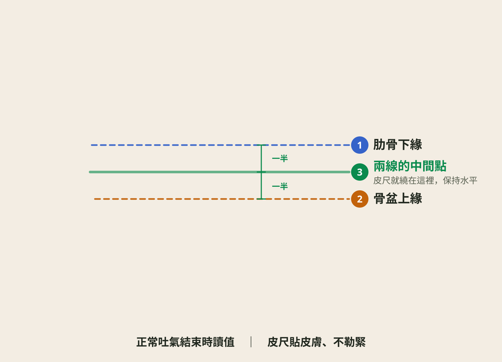

# 第②章　我需要管理體重嗎？（BMI／腰圍自我評估）

> 適用：一般成年民眾。30 秒量出兩個數字，對照表格就知道自己站在哪裡。
> 狀態：**已審定**（2026-08-24 醫師審稿通過）。
> 網站版此章將內嵌**互動計算器**（輸入身高體重腰圍→自動分級；純前端計算，不回傳任何資料）。

---

## 本章想讓讀者帶走的三句話

1. 兩個數字就能初步評估：**BMI** 看整體，**腰圍** 看內臟脂肪。
2. **BMI 正常不代表過關**——腰圍超標的「泡芙人」風險一樣高。
3. 對照結果分三種顏色：綠燈維持、黃燈開始調整、紅燈建議就醫評估。

---

## 2-1 動手算 BMI

- **民眾版**：BMI＝體重（公斤）÷ 身高（公尺）÷ 身高（公尺）。
  例：70 公斤、1.65 公尺 → 70 ÷ 1.65 ÷ 1.65 ≈ **25.7**。
  台灣成人標準（衛福部國健署）：

  | BMI | 分級 |
  |---|---|
  | 低於 18.5 | 體重過輕 |
  | 18.5–24 | 健康體位 |
  | 24–27 | **過重** |
  | 27–30 | 輕度肥胖 |
  | 30–35 | 中度肥胖 |
  | 35 以上 | 重度肥胖 |

- **醫師備註**：一律用國健署台灣切點（24/27），與第①章一致；不要混用 WHO 25/30。網站計算器的分級邏輯以此表為準。
- **出處**：國健署成人健康體位標準

## 2-2 量腰圍：比體重計更誠實的一條線

- **民眾版**：腰圍量的是**內臟脂肪**——包在肝臟、腸子外面的脂肪，正是它在影響血糖血壓。量法三步驟：
  1. 除去腰部覆蓋衣物，輕鬆站立，雙手自然下垂
  2. 皮尺繞過**肋骨下緣與骨盆上緣的中間點**（大約與肚臍同高），保持水平
  3. **正常吐氣結束時**讀數字，皮尺貼皮膚但不勒緊
  標準：男性未滿 **90 公分**、女性未滿 **80 公分**。超過就代表內臟脂肪過多。

  

- **醫師備註**：量測時機建議晨起空腹較穩定；民眾版不強制，量法正確優先。插圖沿革：2026-08-24 加寫實示範照＋另一張三步驟定位示意圖；**2026-08-26 依醫師指示合併為一張**——標示直接畫在示範照上（`design/腰圍量測-標示.inline.svg`，以 SVG 疊在照片上，build 時內嵌進頁面），刪除獨立的示意圖，避免同一件事看兩張圖。示意圖原始檔 `design/腰圍量測-插圖.svg` 保留備用，未上站。
- **出處**：國健署腰圍量測標準（男 90／女 80 cm）

## 2-3 BMI 正常就沒事？小心「泡芙人」

- **民眾版**：有一種人 BMI 標準、四肢不粗，但肚子軟軟凸凸、體脂肪偏高——俗稱**泡芙人**。因為肌肉少、內臟脂肪多，血糖血脂的風險不輸過重的人。所以**BMI 和腰圍要一起看**：BMI 正常但腰圍超標，一樣要往下讀第④⑤章，把飲食和肌力練回來。
- **醫師備註**：對應 normal weight obesity／肌少型肥胖概念，民眾版只用「泡芙人」俗稱＋行為建議，不展開體脂率切點（避免引導民眾去追體脂計數字）。
- **出處**：醫師臨床衛教經驗 ⚠️待醫師確認寫法

## 2-4 對照你的結果：綠燈、黃燈、紅燈

- **民眾版**：把兩個數字放進來，看你是哪一燈——

  | 燈號 | 條件 | 建議 |
  |---|---|---|
  | 🟢 綠燈 | BMI 18.5–24 **且** 腰圍未超標 | 維持現在的生活型態，每年量一次 |
  | 🟡 黃燈 | BMI 24–27 **或** 腰圍超標 | 從第④章（吃）、第⑤章（動）開始調整，3 個月後再量 |
  | 🔴 紅燈 | BMI 27 以上；或 BMI 24 以上**加上**高血壓／血糖異常／脂肪肝等任一項 | 建議到減重門診做完整評估（見第⑦章）——這不是最後手段，是最有效率的起點 |

- **醫師備註**：紅燈條件對應肥胖治療適應症的民眾白話版（BMI≥27，或 BMI≥24 併共病）。「不是最後手段，是最有效率的起點」呼應第①章去污名化與第⑦章導流。體重過輕（<18.5）者網站版加一行「請找醫師評估，不適用本站減重建議」。
- **出處**：肥胖治療適應症通則（國健署／台灣肥胖醫學會方向）⚠️切點組合待醫師審定

## 2-5 自我紀錄的起點

- **民眾版**：今天的數字就是你的起點。找一張紙或手機備忘錄，記下：**日期、體重、腰圍**。目標不是數字漂亮，是**下個月的你比這個月健康**。
- **醫師備註**：量測頻率建議依醫師審稿指示刪除（2026-08-24）；本站不提供雲端紀錄（不收資料），引導自行紀錄即可。
- **出處**：行為改變自我監測通則

---

## 審稿追蹤

全章已審定（2026-08-24 醫師審稿通過；①②含第一輪修訂後複審）。
